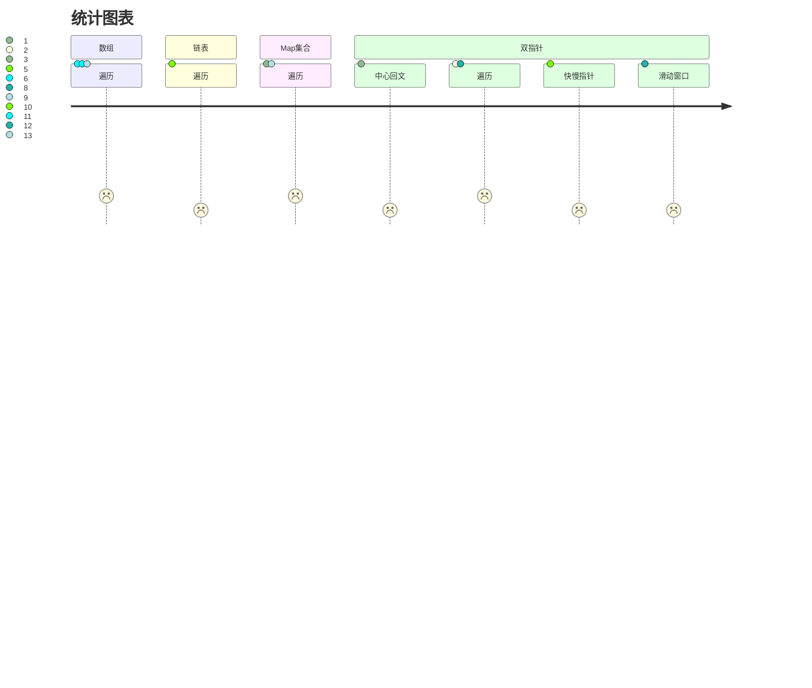

# 频度题目

---

#### 题型

数组

- 遍历

链表

- 遍历

Map集合

双指针

- 中心回文

- 遍历

- 快慢指针

- 滑动窗口

#### 题目

1. 最长回文字串，双指针-中心回文

2. 合并两个有序数组，双指针-倒序遍历

3. 两数之和，Map集合判断

4. 无重复字符的最长字串，Map集合判断、快慢指针

5. 两数相加，链表遍历

6. 寻找两个正序数组的中位数，数组遍历，根据数组奇偶性返回中心值

7. 三数之和，数组遍历，使用三个指针

8. 接雨水，双指针遍历，需要记录左右侧最高的位置

9. LRU缓存，map集合

10. 移除元素，双指针，快慢指针

11. 买卖股票的最佳时机，数组遍历

12. 盛最多水的容器，滑动窗口

13. 最长公共前缀，数组遍历

## 图表

